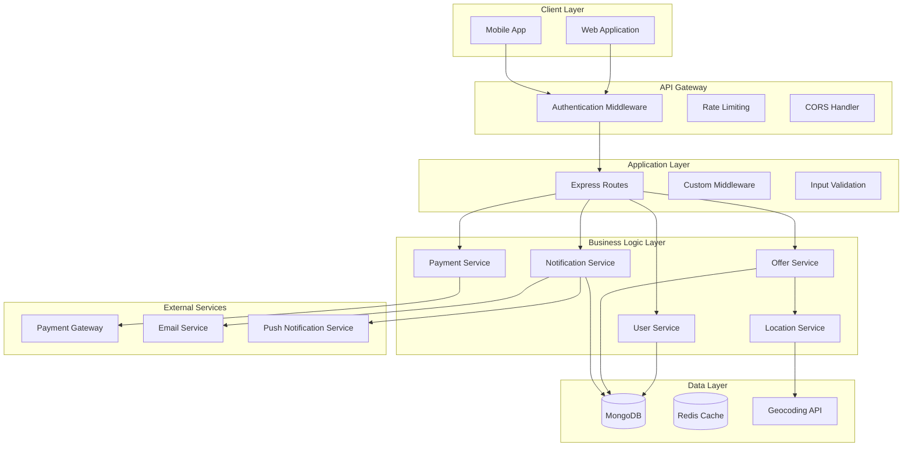
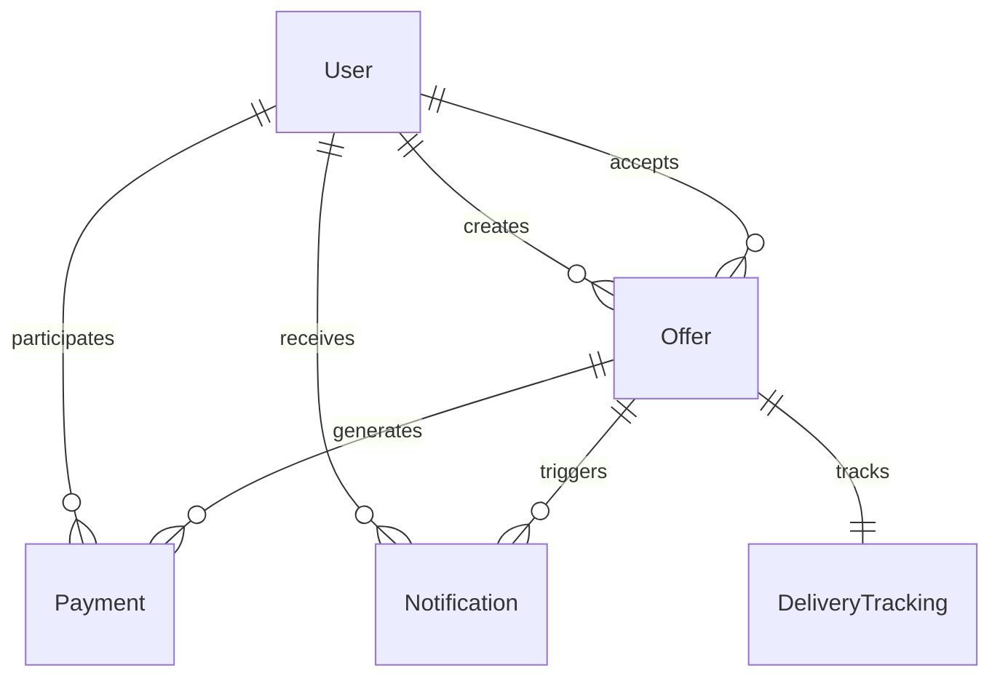

# Design Document

## Overview

The Last Mile delivery platform is a location-based service that connects businesses with nearby riders for package delivery. The system is built on a Node.js/Express backend with MongoDB for data persistence, utilizing geospatial queries for location-based matching and real-time notifications for seamless communication between users.

The platform follows a RESTful API architecture with JWT-based authentication, supporting two primary user roles: businesses (who post delivery offers) and riders (who accept and complete deliveries). The system emphasizes real-time updates, location accuracy, and transaction transparency.

### Design Theme

The platform features a **minimalistic modern white and black theme** that prioritizes:
- **Clean Interface**: Predominantly white backgrounds with black text for optimal readability
- **Minimal Color Palette**: Primary use of white (#FFFFFF), black (#000000), and subtle grays (#F8F9FA, #E9ECEF, #6C757D)
- **Modern Typography**: Clean, sans-serif fonts with appropriate hierarchy and spacing
- **Focused UI Elements**: Simple buttons, cards, and forms with subtle shadows and clean borders
- **Intuitive Navigation**: Clear visual hierarchy with minimal distractions
- **Responsive Design**: Mobile-first approach with consistent spacing and layout patterns

## Architecture

### System Architecture



### Database Architecture

The system uses MongoDB with the following collections:
- **users**: Store business and rider profiles
- **offers**: Store delivery offers with geospatial indexing
- **notifications**: Store user notifications and read status
- **payments**: Store payment transactions and history
- **delivery_tracking**: Store real-time delivery status updates

## Components and Interfaces

### Authentication System

**Enhanced User Model:**
```javascript
{
  _id: ObjectId,
  name: String,
  email: String (unique),
  password: String (hashed),
  role: String (enum: ['business', 'rider']),
  profile: {
    // Business-specific fields
    businessName: String,
    businessAddress: {
      street: String,
      city: String,
      state: String,
      zipCode: String,
      coordinates: [Number] // [lng, lat]
    },
    businessPhone: String,
    
    // Rider-specific fields
    phone: String,
    vehicleType: String (enum: ['bike', 'scooter', 'car', 'van']),
    currentLocation: {
      type: 'Point',
      coordinates: [Number] // [lng, lat]
    },
    isAvailable: Boolean,
    rating: Number,
    completedDeliveries: Number
  },
  isVerified: Boolean,
  createdAt: Date,
  updatedAt: Date
}
```

**Authentication Middleware:**
- JWT token validation
- Role-based access control
- Rate limiting per user
- Session management

### Offer Management System

**Enhanced Offer Model:**
```javascript
{
  _id: ObjectId,
  business: ObjectId (ref: User),
  title: String,
  description: String,
  packageDetails: {
    weight: Number,
    dimensions: {
      length: Number,
      width: Number,
      height: Number
    },
    fragile: Boolean,
    specialInstructions: String
  },
  pickup: {
    address: String,
    coordinates: [Number], // [lng, lat]
    contactName: String,
    contactPhone: String,
    availableFrom: Date,
    availableUntil: Date
  },
  delivery: {
    address: String,
    coordinates: [Number], // [lng, lat]
    contactName: String,
    contactPhone: String,
    deliverBy: Date
  },
  payment: {
    amount: Number,
    currency: String,
    paymentMethod: String
  },
  status: String (enum: ['open', 'accepted', 'picked_up', 'in_transit', 'delivered', 'completed', 'cancelled']),
  acceptedBy: ObjectId (ref: User),
  acceptedAt: Date,
  estimatedDistance: Number, // in meters
  estimatedDuration: Number, // in minutes
  actualDistance: Number,
  actualDuration: Number,
  createdAt: Date,
  updatedAt: Date
}
```

**Offer Service Interface:**
```javascript
class OfferService {
  async createOffer(businessId, offerData)
  async getNearbyOffers(riderLocation, filters)
  async acceptOffer(offerId, riderId)
  async updateOfferStatus(offerId, status, userId)
  async getOffersByBusiness(businessId)
  async getOffersByRider(riderId)
  async calculateDistance(pickup, delivery)
  async estimateDeliveryTime(distance, vehicleType)
}
```

### Location Services

**Geospatial Queries:**
- MongoDB 2dsphere indexing for efficient location queries
- Configurable search radius for offer discovery
- Distance calculation between pickup and delivery points
- Real-time location tracking for active deliveries

**Location Service Interface:**
```javascript
class LocationService {
  async geocodeAddress(address)
  async reverseGeocode(coordinates)
  async calculateRoute(origin, destination)
  async updateRiderLocation(riderId, coordinates)
  async getNearbyRiders(coordinates, radius)
  async validateAddress(address)
}
```

### Notification System

**Enhanced Notification Model:**
```javascript
{
  _id: ObjectId,
  user: ObjectId (ref: User),
  offer: ObjectId (ref: Offer),
  type: String (enum: [
    'offer_accepted',
    'offer_completed',
    'pickup_ready',
    'in_transit',
    'delivered',
    'payment_processed',
    'new_offer_nearby'
  ]),
  title: String,
  message: String,
  data: Object, // Additional notification data
  channels: [String], // ['push', 'email', 'in_app']
  read: Boolean,
  readAt: Date,
  createdAt: Date
}
```

**Notification Service Interface:**
```javascript
class NotificationService {
  async createNotification(userId, type, data)
  async sendPushNotification(userId, notification)
  async sendEmailNotification(userId, notification)
  async markAsRead(notificationId, userId)
  async getUserNotifications(userId, filters)
  async subscribeToOfferUpdates(userId, offerId)
}
```

### Payment System

**Payment Model:**
```javascript
{
  _id: ObjectId,
  offer: ObjectId (ref: Offer),
  business: ObjectId (ref: User),
  rider: ObjectId (ref: User),
  amount: Number,
  platformFee: Number,
  riderEarnings: Number,
  currency: String,
  paymentMethod: String,
  status: String (enum: ['pending', 'processing', 'completed', 'failed', 'refunded']),
  transactionId: String,
  processedAt: Date,
  createdAt: Date
}
```

**Payment Service Interface:**
```javascript
class PaymentService {
  async processPayment(offerId, paymentData)
  async calculateFees(amount)
  async refundPayment(paymentId, reason)
  async getPaymentHistory(userId, filters)
  async updatePaymentStatus(paymentId, status)
}
```

### Real-time Tracking System

**Delivery Tracking Model:**
```javascript
{
  _id: ObjectId,
  offer: ObjectId (ref: Offer),
  rider: ObjectId (ref: User),
  events: [{
    type: String (enum: ['accepted', 'picked_up', 'in_transit', 'delivered']),
    timestamp: Date,
    location: {
      type: 'Point',
      coordinates: [Number]
    },
    notes: String
  }],
  currentLocation: {
    type: 'Point',
    coordinates: [Number]
  },
  estimatedArrival: Date,
  createdAt: Date,
  updatedAt: Date
}
```

## Data Models

### User Profile Enhancement

The existing User model will be extended to include comprehensive profile information for both businesses and riders, supporting role-specific fields and verification status.

### Geospatial Indexing

All location-based collections will utilize MongoDB's 2dsphere indexing:
```javascript
// Offers collection
offerSchema.index({ 'pickup.coordinates': '2dsphere' });
offerSchema.index({ 'delivery.coordinates': '2dsphere' });

// Users collection (for rider locations)
userSchema.index({ 'profile.currentLocation': '2dsphere' });
```

### Data Relationships



## Error Handling

### Error Categories

1. **Validation Errors (400)**
   - Invalid input data
   - Missing required fields
   - Format validation failures

2. **Authentication Errors (401)**
   - Invalid or expired tokens
   - Unauthorized access attempts

3. **Authorization Errors (403)**
   - Role-based access violations
   - Resource ownership violations

4. **Resource Errors (404)**
   - Offer not found
   - User not found
   - Invalid endpoints

5. **Business Logic Errors (409)**
   - Offer already accepted
   - Invalid status transitions
   - Conflicting operations

6. **External Service Errors (502/503)**
   - Payment gateway failures
   - Geocoding service unavailable
   - Email service failures

### Error Response Format

```javascript
{
  error: {
    code: "OFFER_ALREADY_ACCEPTED",
    message: "This offer has already been accepted by another rider",
    details: {
      offerId: "60f7b3b3b3b3b3b3b3b3b3b3",
      acceptedBy: "60f7b3b3b3b3b3b3b3b3b3b4",
      acceptedAt: "2023-07-20T10:30:00Z"
    },
    timestamp: "2023-07-20T10:35:00Z"
  }
}
```

### Error Handling Middleware

```javascript
class ErrorHandler {
  static handleValidationError(error)
  static handleAuthenticationError(error)
  static handleBusinessLogicError(error)
  static handleExternalServiceError(error)
  static logError(error, context)
  static notifyAdministrators(criticalError)
}
```

## Testing Strategy

### Unit Testing

- **Model Testing**: Validate data models, schema validation, and business logic
- **Service Testing**: Test individual service methods with mocked dependencies
- **Utility Testing**: Test helper functions, calculations, and transformations

### Integration Testing

- **API Endpoint Testing**: Test complete request/response cycles
- **Database Integration**: Test database operations and queries
- **External Service Integration**: Test payment gateway, geocoding, and notification services

### End-to-End Testing

- **User Journey Testing**: Complete workflows from registration to delivery completion
- **Cross-Role Testing**: Business and rider interactions
- **Real-time Feature Testing**: Location updates, notifications, and status changes

### Performance Testing

- **Load Testing**: Concurrent user scenarios and high-volume offer processing
- **Geospatial Query Performance**: Location-based search optimization
- **Database Performance**: Query optimization and indexing validation

### Testing Tools and Framework

```javascript
// Jest configuration for comprehensive testing
module.exports = {
  testEnvironment: 'node',
  setupFilesAfterEnv: ['<rootDir>/tests/setup.js'],
  testMatch: [
    '<rootDir>/tests/unit/**/*.test.js',
    '<rootDir>/tests/integration/**/*.test.js',
    '<rootDir>/tests/e2e/**/*.test.js'
  ],
  collectCoverageFrom: [
    'models/**/*.js',
    'routes/**/*.js',
    'services/**/*.js',
    'utils/**/*.js'
  ],
  coverageThreshold: {
    global: {
      branches: 80,
      functions: 80,
      lines: 80,
      statements: 80
    }
  }
};
```

### Security Testing

- **Authentication Security**: Token validation, session management
- **Authorization Testing**: Role-based access control validation
- **Input Validation**: SQL injection, XSS prevention
- **Rate Limiting**: API abuse prevention
- **Data Privacy**: PII protection and GDPR compliance